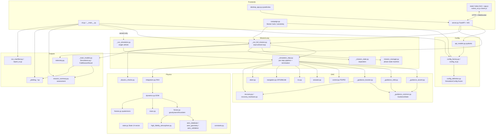
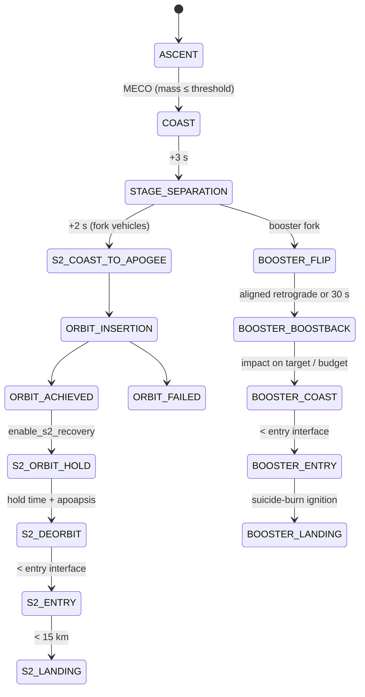
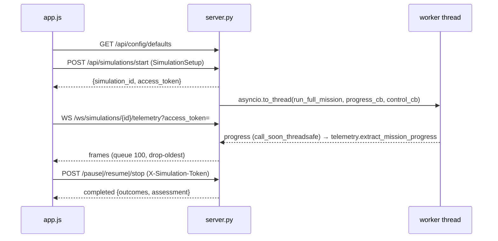

# Codebase Map

> Auto-generated by Cartographer. Last mapped: 2026-10-06T12:23:37Z; updated 2026-10-07T02:13:04Z after the review/refactor/performance pass.

**Boostback (`rlv_sim` v0.2.0)** — research-grade 6-DOF simulator of a two-stage reusable launch vehicle: stacked ascent → stage separation → S2 orbit insertion (optional S2 deorbit/entry/drone-ship landing) + S1 booster flip/boostback/entry/landing (RTLS). Three front ends: CLI, FastAPI web app, pywebview desktop app. Not validated against flight data (see `docs/MATHEMATICAL_REFERENCES.md`).

## System Overview



## Directory Structure

```
rlv_sim/                    # repo root IS the package; parent dir (D:\) must be on sys.path
├── __init__.py __main__.py main.py cli.py      # entry points / re-exports
├── server.py api_models.py desktop_app.py      # web + desktop
├── desktop_app.spec version_info.txt           # PyInstaller → dist/Boostback.exe
├── campaign.py mission_planner.py      # batch runs / feasibility check
├── config_definition.py config_factory.py config_io.py
├── _run_full_mission.py _run_simulation.py _simulation_step.py
├── mission_manager.py _mission_manager_helpers.py _mission_state.py
├── _guidance_{common,ascent,orbit,booster}.py
├── control.py actuator.py rcs.py navigation.py abort.py
├── recovery.py recovery_hardware.py
├── forces.py dynamics.py integrators.py mass.py frames.py state.py constants.py utils.py _types.py
├── aero_database.py aero_geometry.py aero_validation.py high_fidelity_atmosphere.py physics_checks.py
├── _main_models.py mission_summary.py report_io.py run_manifest.py telemetry.py
├── _plotting_{common,general,mission}.py       # matplotlib (Agg), ~80 PNGs
├── aero_decks/geometry_deck.json               # generated by aero_geometry.py
├── static/ (index.html, js/app.js rocket_viz.js charts.js vendor/three.min.js, css/)
├── tests/                                      # pytest + 1 node test + 1 playwright e2e
├── docs/ (main.tex, MATHEMATICAL_REFERENCES.md, CODEBASE_MAP.md)
├── plots/                                      # default output dir
```

## Module Guide

### Entry points

| File | Purpose |
|---|---|
| `cli.py` | Main CLI. `--mission full|ascent`, `--profile research|demo`, `--config-json`, `--dt`, `--max-time`, `--nav-mode truth|onboard`, `--reuse-stage2`, `--s2-orbit-hold`, `--enable/--disable-abort-modes`, `--attitude-controller`, `--recovery-attitude-controller`, `--no-plots`, `--no-telemetry`, `--validation-report`, `-o`. Exit 1 if mission fails, 130 on Ctrl-C. |
| `__main__.py` | `python -m rlv_sim` → `cli.main()` (no `__name__` guard). |
| `main.py` | Re-exports `run_full_mission`, `run_simulation`, `simulation_step`, `check_termination`, `SimulationLog`, `FullMissionResult`. |
| `campaign.py` | Seeded sensitivity / Monte Carlo over thrust, isp, mass, wind, atmosphere, pitchover (±3σ clip). `ProcessPoolExecutor` when workers>1. Writes `campaign_report.json`, `campaign_results.csv`, `campaign_summary.md`. |
| `server.py` | FastAPI + WebSocket backend (see API below). |
| `desktop_app.py` | Starts uvicorn on 127.0.0.1:8756 (or free port) in a thread; opens pywebview window "Boostback". Sets `RLV_ENV=desktop`. |

### Config

- **`config_definition.py`** — frozen `SimulationConfig` (~200 fields: timing, attitude gains, ascent shaping, launch site, orbit target, S2 recovery, masses, booster recovery, grid fins/legs, movable target, physics toggles, nav/abort, `runtime_*` dispersions, `aero_deck_path`, `orbit_coast_max_dt`, `enable_recovery_planner_diagnostics`). `validate()` collects all errors into one `ValueError`; simple range checks are a rule table (`_field_errors`). `meco_mass_kg` property is the single MECO-mass definition. Profile views (`.vehicle`, `.mission`, …) are monkey-patched.
- **`config_factory.py`** — `create_default_config(**overrides)` = **research profile** (tuned booster values; always validates); `create_demo_config` (dt 0.1, demo mode); `create_test_config` (bare dataclass, NOT research profile).
- **`config_io.py`** — `load_config_json(path)` → overrides on top of research profile.
- **`api_models.py`** — pydantic `SimulationSetup` (vehicle/mission/recovery/physics + `advanced_overrides`), `CampaignRequest`. `extra="forbid"`.

### Mission loop

- **`_run_full_mission.run_full_mission(dt, max_time, verbose, config, *, progress_callback, control_callback, realtime_factor)`** → `FullMissionResult`. Phase A `_run_ascent`: stacked ascent until separation. Phase B `_run_dual_vehicles`: fork into orbiter + booster, each with own `MissionManager`, `GuidanceState`, actuator, abort monitor, log; stepped until both terminate. Shared settings/callbacks in frozen `_MissionRuntime`. Stochastic wind applied per step on a config copy (`_make_wind_applier`). Once the booster is done, unpowered orbiter arcs above 120 km use `max(dt, orbit_coast_max_dt)`.
- **`_run_simulation.run_simulation(...)`** → `(final_state, log, reason)` for `"ascent"|"orbiter"|"booster"`.
- **`_simulation_step.simulation_step(state, actuator, mission_mgr, dt, ...)`** → `(new_state, guidance, control, actuator, gs)`. Helpers: `_thrust_magnitude`, `_stage_max_torque`, `_tvc_authority`, `_apply_ground_contact`, `_log_force_breakdown`. Also `check_termination` (records booster touchdown speed / pad error on the `MissionManager`), pad constraint, runtime safety limits, energy tracker.
- **`mission_manager.py`** — `MissionPhase` enum + `MissionManager.update()` dispatching to `_update_stack_phases`, `_update_coast_to_apogee`, `_update_orbit_insertion`, `_update_s2_recovery`, `_update_booster` (→ `_update_boostback`, `_update_booster_entry`). Constructor calls `config.validate()`.
- **`_mission_state.py`** — momentum-balanced separation Δv/tumble, initial state, dt clamping.

### GNC

- **`_guidance_ascent.py`** — altitude-scheduled γ profile + PID (0.85/0.05/0.12), pitchover kick, prograde blend, AoA caps, predictive Max-Q throttle (30 kPa). Not PEG/IGM.
- **`_guidance_orbit.py`** — orbit insertion modes (`RAISE_APOGEE`, `COAST_TO_CIRCULARIZATION`, `CIRCULARIZE`, `HOLD_ORBIT`, `FAILED_UNREACHABLE`) chosen by `_select_insertion_mode`, laws in `_circularization_command` / `_raise_apogee_command`; deorbit (retrograde, cap 300 m/s); S2 entry (retrograde) and S2 landing (suicide burn, `a = v²/2(h-40)+g`); coast.
- **`_guidance_booster.py`** — `compute_booster_guidance` builds a frozen `_BoosterContext` and dispatches: flip, boostback (horizontal velocity targeting, throttle 0.9), coast, `_entry_guidance` (entry burn + terminal capture, ZEM/ZEV), `_landing_guidance` (latched suicide burn with altitude-banded divert, touchdown cone). Falls back to the default config when `config=None`. Trajectory planner is **diagnostic only** and off unless `enable_recovery_planner_diagnostics`.
- **`_gfold.py`** — optional G-FOLD convex minimum-fuel landing burn (cvxpy/Clarabel SOCP, receding horizon, terminal gate). Selected by `booster_landing_guidance='gfold'` (CLI `--landing-guidance`, UI Booster Recovery toggle). Guidance only; 6-DOF unchanged. Falls back to the heuristic when infeasible.
- **`_guidance_common.py`** — `GuidanceState` (per-vehicle mutable memory), local frames, γ/blend profiles, AoA limiter.
- **`control.py`** — thrust-axis PD/PID; gain scheduling by inertia; anti-windup; RCS-only deadband 3.5°.
- **`actuator.py`** gimbal slew 25°/s · **`rcs.py`** RCS torque & propellant · **`navigation.py`** optional GPS/IMU/altimeter estimator (guidance only; physics uses truth) · **`abort.py`** `AbortMonitor` (PAD_ABORT/RTLS/DOWNRANGE/ATO/SELF_DESTRUCT).
- **`recovery.py`** — landing-site targeting, ballistic impact predictor, suicide-burn estimator, movable target. **`recovery_hardware.py`** — grid fins, landing legs, `assess_touchdown_contact`.

### Physics

- **`state.py`** — `State`: 14-vector `[r, v, q(w,x,y,z), ω, m]` + `t`, `sim_config`, `dry_mass_kg`. Rejects non-unit quaternions (no renormalize).
- **`integrators.py`** — RK4 only; burnout split into powered + coast sub-steps; quaternion normalized per sub-step.
- **`dynamics.py`** — `ω̇ = I⁻¹(τ + τ_aero − ω×Iω − İω − τ_jet)`; `r̈ = F/m` in ECI.
- **`forces.py`** — gravity (`central`/`j2`/`egm96` deg-6), US76 atmosphere, drag/lift/moment (analytic or aero deck), pressure-compensated thrust with TVC as lateral thrust, engine transients, heating.
- **`mass.py`** — mass flow (negative), CG, diagonal inertia interpolation per vehicle model.
- **`frames.py`** — quaternion math (`direction_to_quaternion` uses the exact half-way quaternion). **`constants.py`** — all vehicle/physical constants (Falcon-9-like). **`utils.py`** — power-law wind, relative velocity, and the fast 3-vector helpers `cross3` / `vec_norm` (use these, not `np.cross` / `np.linalg.norm`, in hot paths).
- **`_numba_kernels.py`** — optional Numba-compiled EGM96 gravity (`egm96_accel`) and ballistic impact predictor (`propagate_to_surface`). Used automatically when numba is installed (`fast` extra); pure-Python paths otherwise.
- **`aero_database.py`** 4-D deck interpolator · **`aero_geometry.py`** analytic deck generator · **`aero_validation.py`** shape-only checks · **`high_fidelity_atmosphere.py`** WGS-84 + GRAM-style density · **`physics_checks.py`** per-step invariants (`ValidationError`).

### Outputs

- **`_main_models.py`** — `SimulationLog` (dict-of-lists, ~120 columns, `to_csv`), `FullMissionResult` (now also `booster_touchdown_speed_mps`, `booster_site_error_m`).
- **`mission_summary.py`** — `assess_full_mission` → `MissionAssessment` (orbit + landing + failed_criteria); `write_mission_summary` (JSON + MD).
- **`run_manifest.py`** provenance JSON · **`report_io.py`** compare runs vs reference with tolerances · **`telemetry.py`** frontend telemetry dicts.
- **`_plotting_common.py`** (`TrajectoryData`, declarative helpers), **`_plotting_general.py`** (~56 ascent plots), **`_plotting_mission.py`** (19 mission + 5 S2 plots, `generate_all_plots`, `write_plot_manifest`).

## Data Flow

### Per-timestep pipeline (`simulation_step`)

```mermaid
sequenceDiagram
    participant Loop as run_full_mission
    participant MM as MissionManager
    participant G as Guidance (by phase)
    participant HW as Booster HW
    participant A as Actuator/Throttle
    participant C as control.py
    participant I as RK4 integrator
    Loop->>MM: update(state) → phase transitions
    Loop->>G: _run_guidance (nav estimate → phase dispatch)
    G-->>Loop: thrust dir, throttle, thrust_on
    Loop->>HW: grid fins + legs (booster only)
    Loop->>A: gimbal rate limit (skipped for recovery phases), engine transient
    Loop->>C: inertia, torque limits (TVC+RCS), PD/PID → torque allocation
    Loop->>I: DynamicsContext → integrate()
    I-->>Loop: new State
    Loop->>Loop: ground crossing / pad constraint, log forces, check_termination
```

### Mission phases



### Web UI



### Server API

| Method/path | Notes |
|---|---|
| `GET /`, `/static/*`, `GET /api/health` | no auth |
| `GET /api/aero/validation[/tier2]` | aero reports |
| `GET /api/config/defaults` · `POST /api/config/validate` (multipart .json) | |
| `POST /api/simulations/start` | max 5 concurrent; rate limit |
| `POST /api/simulations/{id}/pause|resume|stop` · `GET /api/simulations/{id}` | need `X-Simulation-Token` |
| `WS /ws/simulations/{id}/telemetry` | key via header or `?api_key=`; token `?access_token=` |
| `POST /api/campaigns/start` · `GET /api/campaigns/{id}` · `POST /api/campaigns/{id}/cancel` | max 2 concurrent |

Env vars: `RLV_ENV`, `RLV_API_KEYS` (unset = no auth), `RLV_ALLOW_NO_AUTH`, `RLV_HOST` (127.0.0.1), `PORT`/`RLV_PORT` (8000), `RLV_CORS_ORIGINS`, `RLV_MAX_REQUEST_BYTES`, `RLV_MAX_CONFIG_UPLOAD_BYTES`, `RLV_START_RATE_LIMIT`, `RLV_START_RATE_WINDOW_SECONDS`, `RLV_MAX_WS_CLIENTS_PER_SIM`.

## Conventions

- **Frames/units:** ECI inertial, spherical Earth (`R_EARTH` = 6.371e6), SI units. Body +Z = thrust axis. Quaternions `[w,x,y,z]` body→inertial. Altitude = `|r| − R_EARTH` everywhere. Logs store altitude/downrange in **km**, pitch in degrees.
- **Imports:** package-relative (`from . import constants as C`); exceptions: `cli.py`, `telemetry.py`, `__main__.py` use absolute `rlv_sim.*`.
- **Private modules** prefixed `_` (`_guidance_*`, `_run_*`, `_plotting_*`).
- **Config is immutable:** `dataclasses.replace(cfg, ...)` then `.validate()` (replace does not validate). Prefer `create_default_config(**overrides)`.
- **Guidance functions** return `(GuidanceOutput dict, GuidanceState)`; state threaded per vehicle, never global.
- **Environment:** `python -m uv sync --extra fast --extra test` (numba + pytest).
- **Tests:** `pytest tests -q` (fast suite; `slow` tests excluded by default); `pytest -m slow` runs the ~35 s full-mission regression (`tests/test_full_mission_regression.py`, pinned orbit/landing references); JS: `node --test tests/test_telemetry_csv.cjs`; e2e needs `playwright install chromium`.
- **Lint:** `ruff check .` is clean (0 warnings); keep it that way. Intentional catch-all boundaries carry targeted `noqa` comments.
- **CI:** `.github/workflows/ci.yml` — ruff, unit tests, JS test, then the slow regression. Checks out into a directory named `rlv_sim` (package layout).
- **Behaviour-preserving refactors:** verify by comparing full-mission telemetry CSVs before/after (`cli --mission full --no-plots -o <dir>`).
- **Run:** `uv run python -m rlv_sim.cli --mission full`; server `PYTHONPATH=D:\ python -m rlv_sim.server`; desktop build `pyinstaller desktop_app.spec`.

## Gotchas

- **Package layout:** repo root is the `rlv_sim` package; its **parent** (`D:\`) must be on `sys.path` (`tests/conftest.py`, `.claude/launch.json` do this).
- **Research vs test config:** `create_default_config` applies tuned booster overrides; `create_test_config` does not. Many defaults differ between `config_definition` and `config_factory` (e.g. ignition safety factor 1.52 vs 1.8).
- **`check_termination` "ascent_only" branch** is dead via normal paths.
- **`run_simulation` (single-vehicle) does not apply `recovery_max_step_dt`**; full mission does.
- **RCS lever arm** is not configurable (`C.RCS_LEVER_ARM`).
- **Global state:** `compute_aerodynamic_moment._post_stall_warned` one-shot flag; aero decks `lru_cache`d by path.
- **`aero_deck_path`** must be a `.json` inside the package's `aero_decks/` (security restriction).
- **S2 recovery is experimental** and propellant-starved (S2 T/W < 1; raising landing reserve breaks insertion).
- **Source-text tests:** `test_telemetry_csv.cjs` slices `app.js` between `function telemetryToCsv()` and `function buildReport(`; `test_small_fixes.py` / `test_server_bugfixes.py` inspect source — renames break them.
- **Server:** WS API key in query string may be logged; state is in-memory only (pruned after 600 s). Config uploads have their own size limit (`RLV_MAX_CONFIG_UPLOAD_BYTES`) and the read is bounded.
- **Numba kernels duplicate Python logic:** `_numba_kernels.propagate_to_surface` re-implements drag, wind and US-76 inline. Change both together; `tests/test_numba_kernels.py` compares them. The predictor falls back to Python when an aero deck is loaded.
- **Orbit coast step:** results depend on `orbit_coast_max_dt` (default 0.5 s; ~1.5 km orbit difference vs 0.05 s). 2 s degrades insertion.
- **Planner telemetry:** `planner_*` columns are zero unless `enable_recovery_planner_diagnostics=True`.
- **Touchdown metrics:** assessment uses `FullMissionResult.booster_touchdown_speed_mps` / `booster_site_error_m`; reason-text parsing is only a fallback for results built without them.
- **`--no-plots`** also skips mission summary and plot manifest; `--validation-report` never changes exit code.
- **`_plotting_mission.main()`** uses `create_default_config()` rather than the run's actual config.

## Navigation Guide

- **Tune ascent trajectory:** `_guidance_ascent.py`, ascent fields in `config_definition.py`, defaults in `config_factory.py`.
- **Change orbit insertion / target orbit:** `_guidance_orbit.py`, `mission_manager.py` (`ORBIT_INSERTION` transitions), `mission_summary.assess_orbit`.
- **Change booster recovery:** `_guidance_booster.py`, `recovery.py`, `recovery_hardware.py`, booster phases in `mission_manager.py`, landing classification in `mission_summary.py`.
- **Add a physics effect / force:** `forces.py` (`_compute_force_breakdown`), `dynamics.py`, toggle field in `config_definition.py`, doc in `docs/MATHEMATICAL_REFERENCES.md`.
- **Add a config field:** `config_definition.py` (+ `validate()`), `config_factory.py` if profile-tuned, `api_models.py` + `server.map_config` + `static/js/app.js` if exposed in UI.
- **Add a logged column:** `_main_models.SimulationLog.append`, guidance output dict key, `_plotting_common.extract_log_data`.
- **Add a plot:** `_plotting_general.py` or `_plotting_mission.py`, register in `generate_all_plots` / `generate_mission_segment_plots`.
- **Add an API endpoint:** `server.py` (+ `Depends(require_api_key)`), models in `api_models.py`, client in `static/js/app.js`.
- **Add a dispersion parameter:** `campaign.PARAMETERS` + `apply_case`, a `runtime_*` field in config, consume in physics.
- **Change success criteria:** `mission_summary.py` (`assess_full_mission`), `_simulation_step._orbiter_outcome_success` / `_booster_landing_success`.
