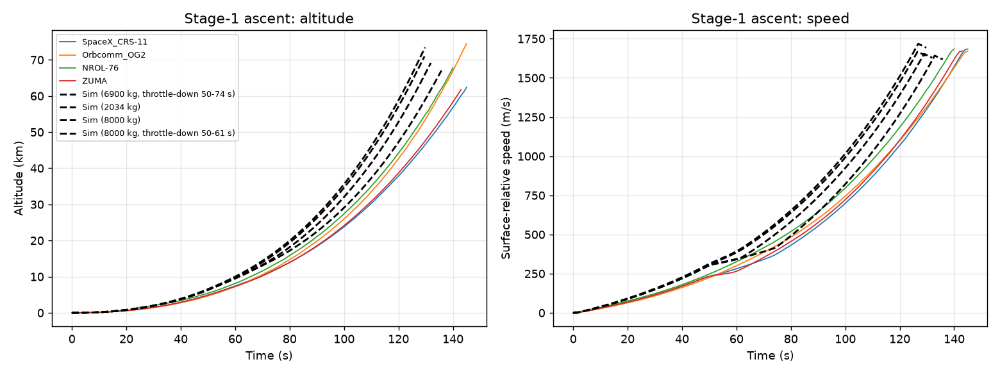

# Validation against Falcon 9 flight telemetry

Generated by `python -m rlv_sim.validation.flight_compare`. Flight data: [shahar603/Telemetry-Data](https://github.com/shahar603/Telemetry-Data) (public domain), extracted from SpaceX webcasts at 1 Hz. Sim: default vehicle (Falcon 9 FT stage masses, 9 x 845 kN), payload matched where published, otherwise the 8 t default; target orbit, inclination and landing site are sim defaults, not the flight's, so differences in booster timeline are partly mission, not model.

## Ascent curve error (lift-off to MECO)

| Flight | Sim payload (kg) | Throttle-down (flight's) | Altitude RMS (km) | Speed RMS (m/s) |
|---|---|---|---|---|
| SpaceX_CRS-11 | 6900 | 50-74 s | 5.27 | 111 |
| Orbcomm_OG2 | 2034 | none (not in data) | 7.79 | 208 |
| NROL-76 | 8000 (unpublished) | none (not in data) | 6.08 | 145 |
| ZUMA | 8000 (unpublished) | 50-61 s | 7.05 | 155 |

## Key events

| Flight | Quantity | Flight | Sim | Difference |
|---|---|---|---|---|
| SpaceX_CRS-11 | MECO time (s) | 145 | 135.8 | -6.3% |
| | MECO speed (m/s) | 1684 | 1618 | -3.9% |
| | MECO altitude (km) | 62.4 | 67.0 | +7.4% |
| | Peak q (kPa) | 23.0 | 29.7 | +28.9% |
| | Max-q time (s) | 65 | 50 | -22.7% |
| | Booster apogee (km) | 120.1 | 126.6 | +5.4% |
| | Boostback start (s) | 161 | 164 | +1.6% |
| | Entry burn start (s) | 372 | 327 | -12.0% |
| | Landing burn start (s) | 429 | 464 | +8.3% |
| | Touchdown (s) | 462 | 503 | +8.9% |
| Orbcomm_OG2 | MECO time (s) | 145 | 129.7 | -10.5% |
| | MECO speed (m/s) | 1670 | 1692 | +1.4% |
| | MECO altitude (km) | 74.5 | 73.4 | -1.5% |
| | Peak q (kPa) | 28.6 | 31.9 | +11.6% |
| | Max-q time (s) | 70 | 62 | -10.7% |
| | Booster apogee (km) | – | 144.9 | – |
| NROL-76 | MECO time (s) | 140 | 129.5 | -7.5% |
| | MECO speed (m/s) | 1685 | 1642 | -2.5% |
| | MECO altitude (km) | 67.8 | 70.9 | +4.6% |
| | Peak q (kPa) | 29.2 | 31.9 | +9.4% |
| | Max-q time (s) | 69 | 63 | -8.3% |
| | Booster apogee (km) | 165.6 | 138.7 | -16.2% |
| | Boostback start (s) | 157 | 157 | +0.3% |
| | Entry burn start (s) | 431 | 341 | -20.8% |
| | Landing burn start (s) | 508 | 456 | -10.3% |
| | Touchdown (s) | 540 | 506 | -6.4% |
| ZUMA | MECO time (s) | 143 | 131.9 | -7.8% |
| | MECO speed (m/s) | 1672 | 1629 | -2.6% |
| | MECO altitude (km) | 61.8 | 69.1 | +11.9% |
| | Peak q (kPa) | 26.0 | 29.4 | +13.4% |
| | Max-q time (s) | 75 | 50 | -33.0% |
| | Booster apogee (km) | 124.9 | 133.5 | +6.8% |
| | Boostback start (s) | 159 | 160 | +0.5% |
| | Entry burn start (s) | 381 | 335 | -12.0% |
| | Landing burn start (s) | 446 | 461 | +3.5% |
| | Touchdown (s) | 459 | 503 | +9.6% |

## Findings

- **MECO speed matches within ~4%** on every flight: the energy the stage delivers is right.
- **Max-q throttle-down.** Where the webcast data shows the throttle-down window (CRS-11, Zuma) the sim flies it (`ascent_throttle_bucket_*`, 70% thrust). On CRS-11 this halves the curve error (altitude RMS 9.2 -> 5.3 km, speed RMS 218 -> 111 m/s) and moves MECO from 15.5 s to 9 s early. Flights without that data still use the q-hold law only.
- **Remaining gap: MECO 6-10% early.** The sim holds back a 67.5 t recovery reserve and its RTLS needs ~3600 m/s; Falcon 9 burns more of stage 1 on ascent, so its real RTLS budget is smaller. Closing this needs a leaner boostback/entry profile, not ascent changes.
- **Peak q still 9-29% high**: Falcon's throttle depth and timing are not published; 70% is an estimate.
- **Booster timelines start right (boostback within ~2%)**; later events differ by up to ~20% because the sim flies its own target orbit and pad. Target inclination was tried per flight and does not change the stage-1 trajectory.
